# Task 02: Prologue – The Logbook of the Grand Line

## LEVEL 1 — AWAKENING AT LOGUETOWN REEF

I first cloned the repo. The task was to find the the devil fruit which i located in one of the .txt files inside the directory.

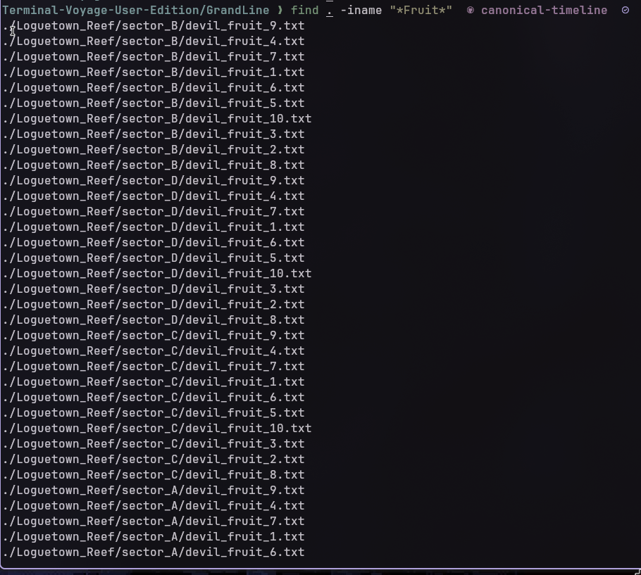

- `find -iname "* file_name  *"` searches for file name

- i used cat to read the eat.sh file and i found out that the txt file that had the fruit is executable so i used `find . -type f -executable` to find the executable files accross the sub directories.

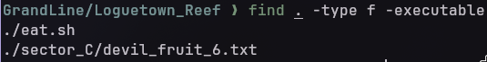

Then i used `./eat.sh <executable_devil_fruit>` to check if it worked..

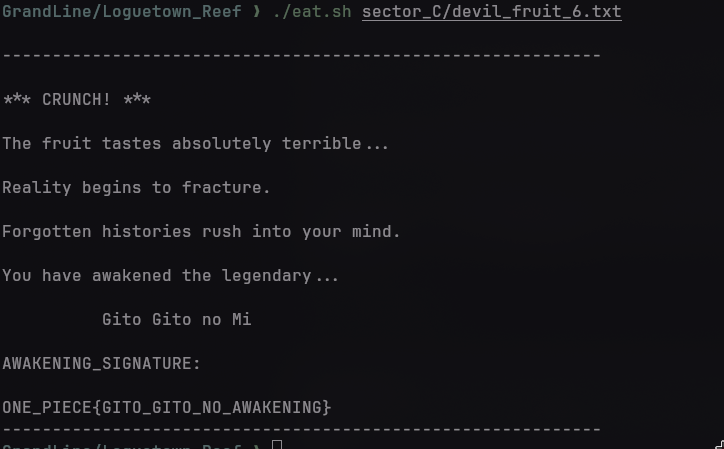

### AWAKENING_SIGNATURE = 'ONE_PIECE{GITO_GITO_NO_AWAKENING}'  

-------------------------------------------------------------------------------------------------------------------------------------

## LEVEL 2 — THE TWO FACES OF WHISKEY PEAK

I switched my branch to whiskey_peak_investigation 
`git checkout whiskey_peak_investigation` 
then i used `ls -a` to view the hidden unlock_vault.sh file

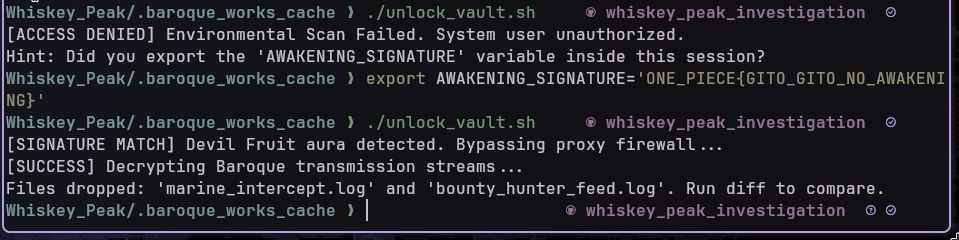

i used `export AWAKENING_SIGNATURE='ONE_PIECE{GITO_GITO_NO_AWAKENING}'` to submit the key i found.

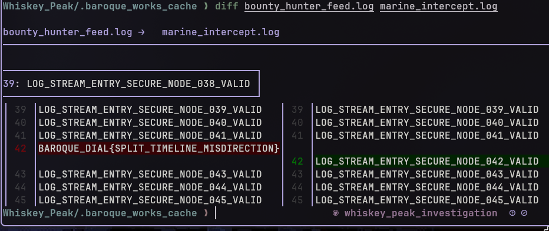

- i used `diff <filename1> <filename2> ` to find the differences between the files and found the next code.

### AWAKENING_SIGNATURE = 'ONE_PIECE{GITO_GITO_NO_AWAKENING}'

------------------------------------------------------------------------------------------------------------------------------------

## LEVEL 3 — THE WAX LABYRINTH OF LITTLE GARDEN

i used `git checkout little_garden` to switch to little garden branch

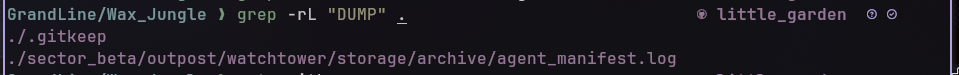

i used `grep -rL "DUMP"	` to find out the files that did not contain system dump 
- `-r` : Recurse subdirectories
- `-L` : List files without match

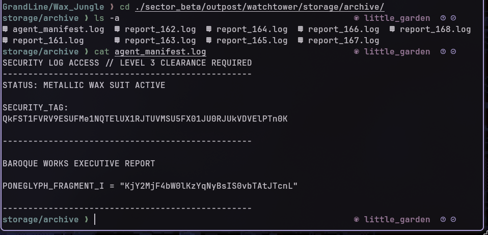

### SECURITY LOG ACCESS // LEVEL 3 CLEARANCE REQUIRED
-------------------------------------------------
STATUS: METALLIC WAX SUIT ACTIVE

### SECURITY_TAG:
QkFST1FVRV9ESUFMe1NQTElUX1RJTUVMSU5FX01JU0RJUkVDVElPTn0K

-------------------------------------------------

BAROQUE WORKS EXECUTIVE REPORT

### PONEGLYPH_FRAGMENT_I = "KjY2MjF4bW0lKzYqNyBsIS0vbTAtJTcnL"

-------------------------------------------------
--------------------------------------------------------------------------------------------------------

## LEVEL 4 — THE CAMOUFLAGED BLUEPRINTS OF WATER 7

i switched branch to alternate_timeline

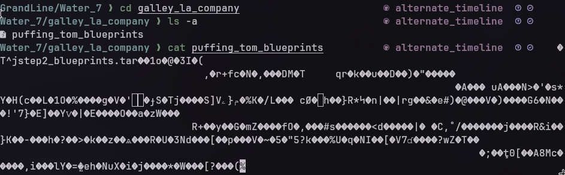

puffing_tom_blueprints was a tar file

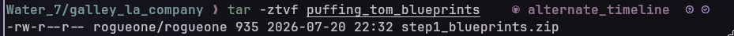

i used `tar -ztvf puffing_tom_blueprints` to list out the contents of the file

then i used `tar -xvf puffing_tom_blueprints step1_blueprints.zip` to extract out the zip file

I used `unzip step1_blueprints.zip` to unzip the zip file

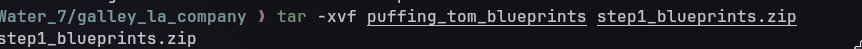

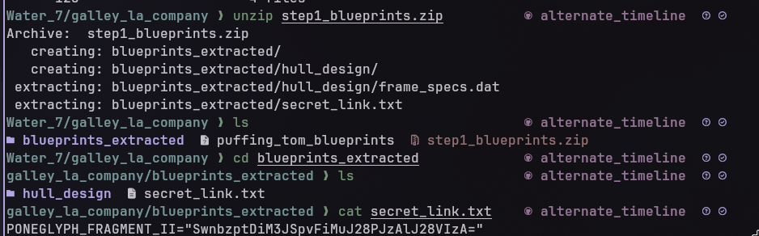
------------------------------------------------------------------------------------------------------------- 

## LEVEL 5 — THE BUSTER CALL TIMELINE RECOVERY

Then i went to Ennies lobby directory and went to .cp9_secure_vault where i ran the python file using `python3 poneglyph.py ` which encoded the key fragmets to give the final challange repo

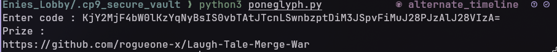

--------------------------------------------------------------------------------------------------

## Level - 6 — THE GREAT MERGE WAR AT LAUGH TALE

I coned the final challange.
I merged the two branches using `git merge <branch_name>` , and resolved the merge conflicts in key_part_1.txt and key_part_2.txt to get the final code.
I then ran the victory.sh file and pasted the code *TheGrandLineRemembers*

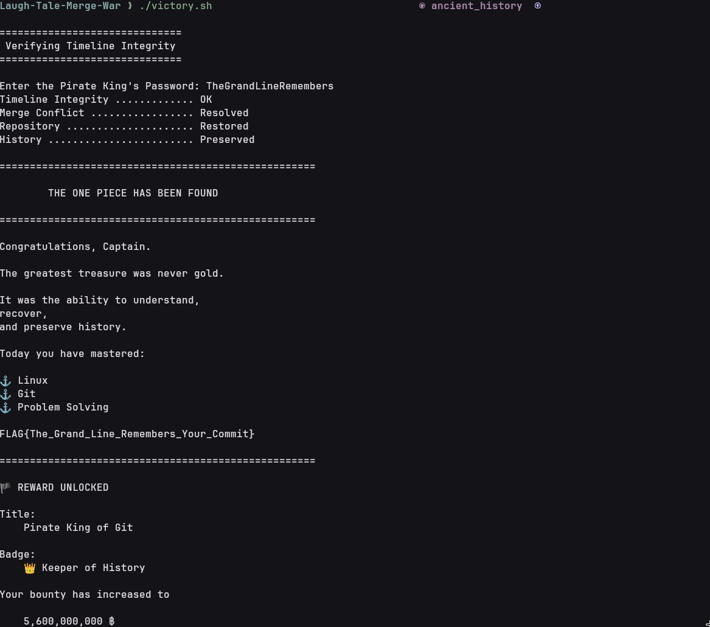
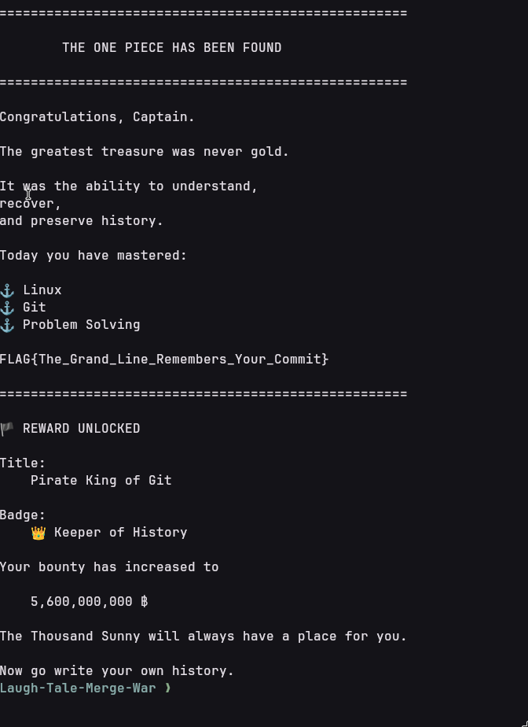
